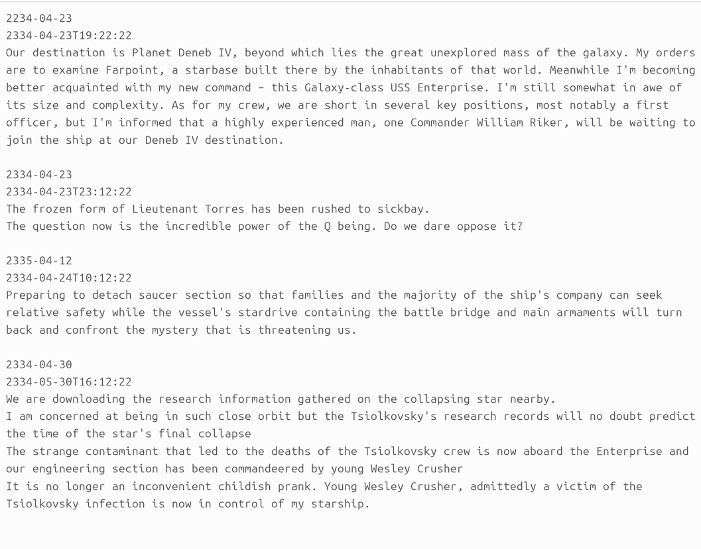

# caplog.txt
A primer on the syntax of the caplog.txt log file format. 

# Description

Caplog.txt is an open, plaintext syntax for formatting and structuring personal log files. It is both machine-readable and human-readable. 
It is future-proof and designed to be interoperable with multiple independent implementations. The plain text syntax is inspired by TODO.txt project. The concept and the name are inspired from Star Trek. 


# Terminology

* A Log entry consists of three parts:
1. Date - Date (and time) associated with the entry
2. Timestamp - the time when the entry was created or last updated.
3. Message - the message of the log entry


# Syntax

* Log entries are separated from each other by one or more blank lines. 
* The first line of the entry must be 'Date'
* The second line of the entry must be 'Timestamp'
* The third line begins the 'Message' block, and it ends with a blank line. The only requirement for an entry message is that it cannot contain a blank line.

## Structure

```text
ENTRY1 DATETIME
ENTRY1 TIMESTAMP
ENTRY1 MESSAGE

ENTRY2 DATETIME
ENTRY2 TIMESTAMP
ENTRY2 MESSAGE

ENTRY3 DATETIME
ENTRY3 TIMESTAMP
ENTRY3 MESSAGE

...
...
...
```

## Example

